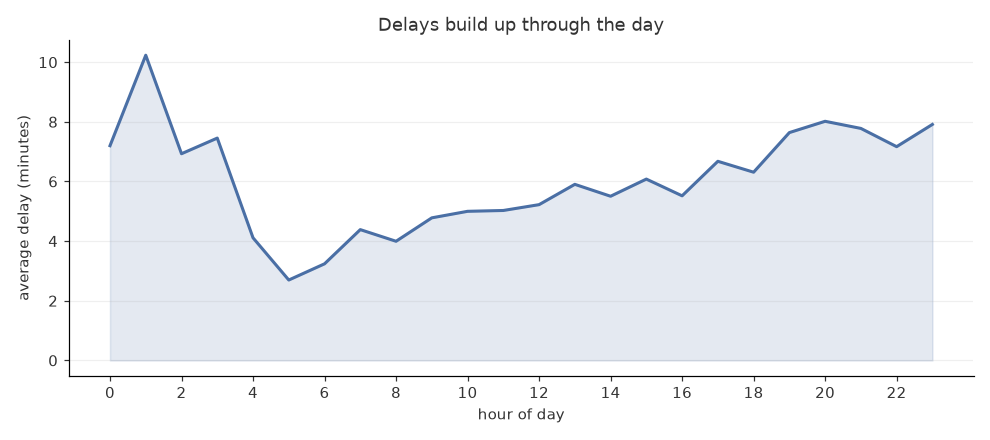
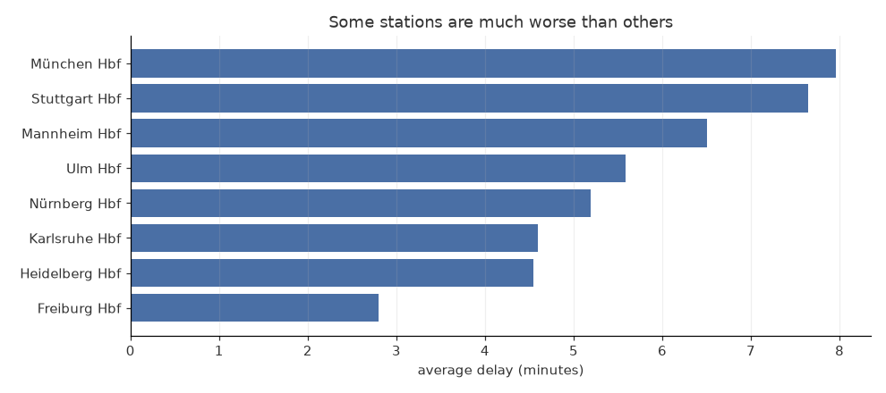
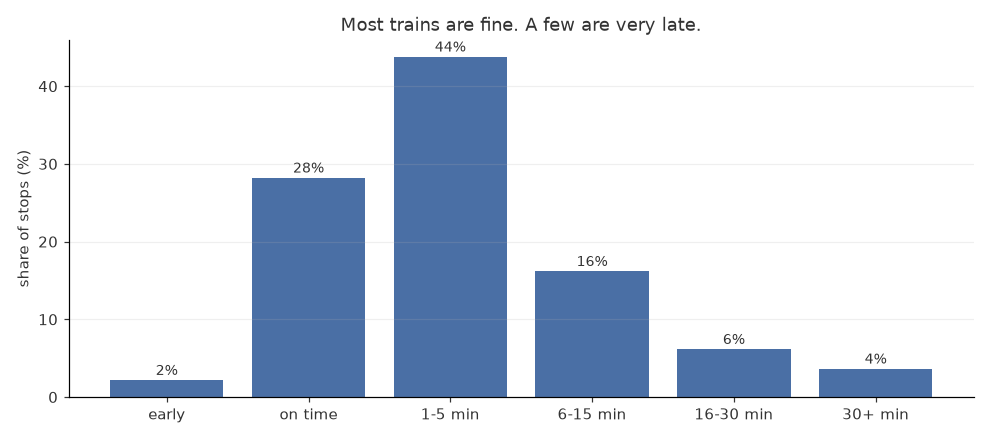

# German Train Delays

Deutsche Bahn shows what its trains are doing right now, and a few minutes
later that information is gone. I wanted to know how late trains actually
are, so I started saving it every two minutes.

Eight stations in the south: Freiburg, Stuttgart, Karlsruhe, Mannheim,
Munich, Nuremberg, Ulm, Heidelberg.

## What I found

Delays are smallest early in the morning and grow all day. By eight in the
evening a train is about three times later than the same train at six in the
morning. Late trains make the next train late, and it only resets overnight.



Which station you are at matters more than I expected. Freiburg is under
three minutes on average, Munich is eight.



Most trains are fine though. Three quarters are within five minutes. It is
the four percent over half an hour that people remember.



Night trains are the worst by a long way, around half an hour on average.
ICE is about six minutes, S-Bahn under three.

From 22,930 stops between 17 and 21 September 2026.

## How it works

```
Deutsche Bahn API
       |
       |  every 2 minutes
       v
   collect.py  ---->  data/     saved replies, never changed
       |
       v
    parse.py  ---->  events_*.parquet
       |
       v
      dbt      ---->  trains.duckdb
```

The API answers two questions and I need both. The plan is the timetable,
what time a train is due, and it only changes once an hour. The changes are
what actually happened, and they change constantly.

Neither is useful on its own. The plan does not know about delays, and the
changes usually give a new time without saying what the old one was. The
delay only appears when you put them together.

`collect.py` saves the reply from the API without reading it. I did it that
way because reading data is where I make mistakes. Early on I read a
disruption message as a cancellation and marked 1,349 trains as cancelled
when they had actually run. Fixing that was one command, because the
original replies were still there:

```
python parse.py --rebuild
```

The same train gets fetched again every two minutes, so one stop shows up in
hundreds of files with a newer guess each time. Only the last one counts.
Then the timetable is joined to the changes, keeping every planned train even
if it never shows up in the changes, because that means it ran on time.

A cancelled train gets no delay at all. It was not late, it never ran.

## Dashboard

```
streamlit run dashboard.py
```

Punctuality by station, delay through the day, by kind of train, and a table
per day. It reads small summary files in `dashboard_data` rather than the
collected replies, so it runs without the full archive.

```
python export_dashboard_data.py
```

rebuilds those summaries after new data comes in.

## Running it

You need a free API key from
[developers.deutschebahn.com](https://developers.deutschebahn.com). Make an
account, make an application, then subscribe that application to the
Timetables API on the free plan. The subscription is a separate step and it
took me a while to notice.

```
pip install -r requirements.txt
cp .env.example .env
```

Put your client id and secret in `.env`, then:

```
python collect.py        leave this running
python parse.py          build the table
python health.py         see what was collected and what is missing
```

For the dbt models:

```
cd dbt
dbt deps
dbt build
```

The stops table is built a day at a time rather than all at once. A train
keeps getting updated for hours after it was due, so the last two days are
rebuilt every run and anything older is left alone.

## Checking it is still collecting

A collector that stops quietly is worse than one that crashes, because the
numbers still look fine afterwards. `health.py` shows every hour, how many
rounds ran, and how many records came back.

It counts records instead of successful requests. While I was looking for a
data source I found one that answered every request with a valid reply, a
fresh timestamp, and no trains in it. Checking only the status code would
have told me everything was fine while I saved nothing.

So far 2,655 rounds out of 2,820. The missing hours are all from one
afternoon before I stopped the laptop sleeping.

## Tests

```
python -m pytest         29 tests, run on every push
cd dbt && dbt build      4 models and 12 tests on the collected data
```

The python tests check the code. The dbt tests check the data, like no two
rows describing the same stop, or a delay so large it has to be a misread
time.

I need both. All the python tests passed the whole time the cancellation bug
was there, because they test the logic and not what the logic was given.
